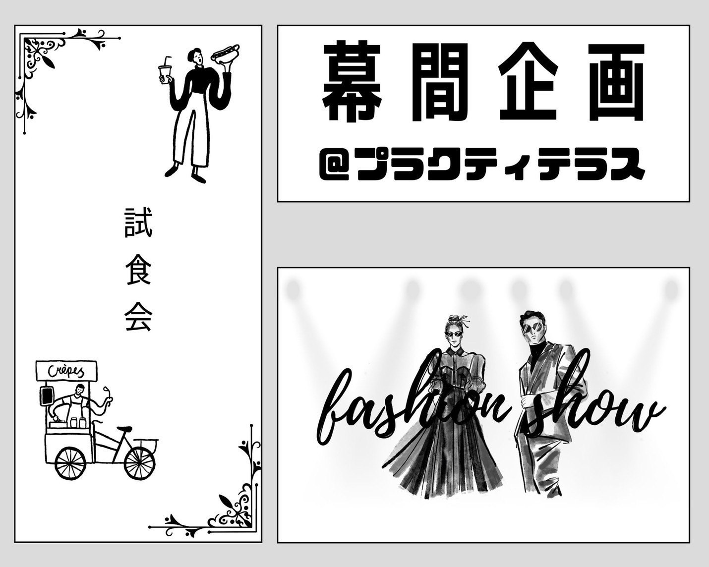
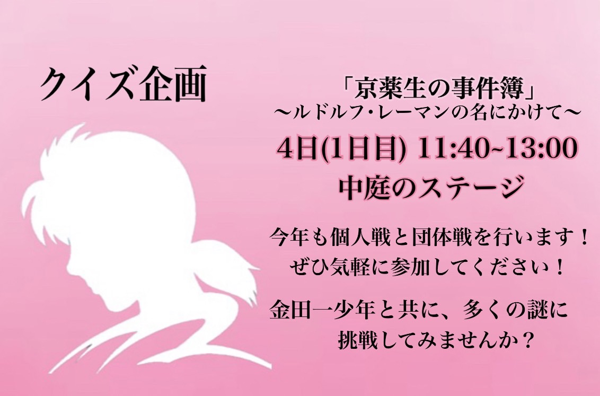
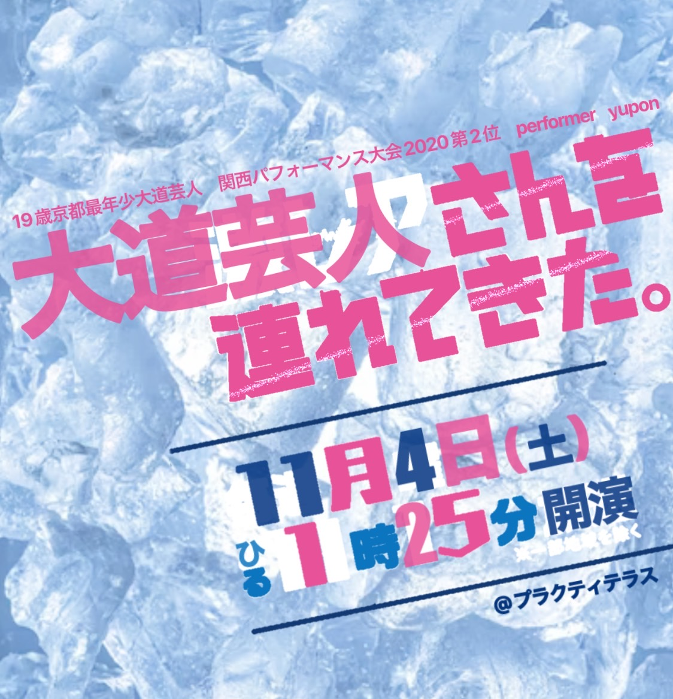
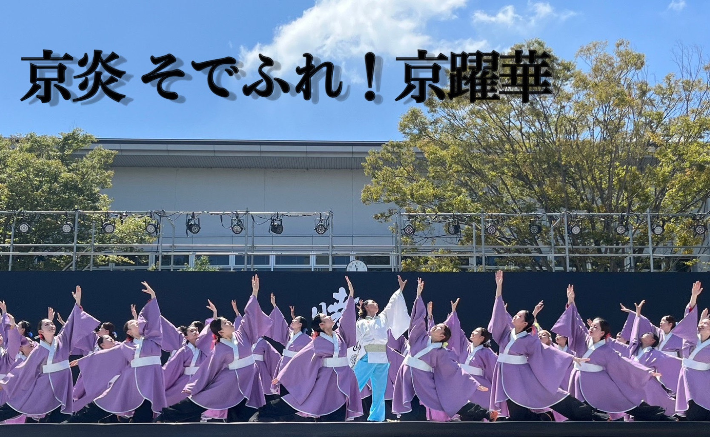
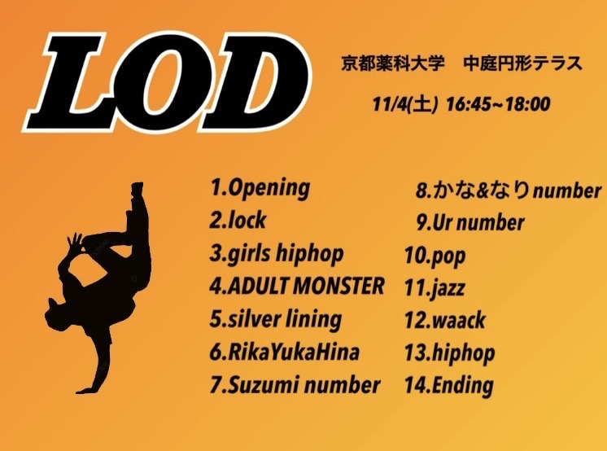
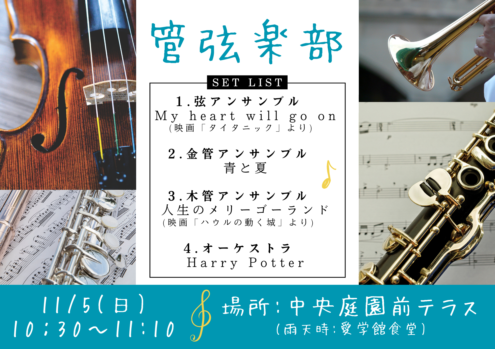
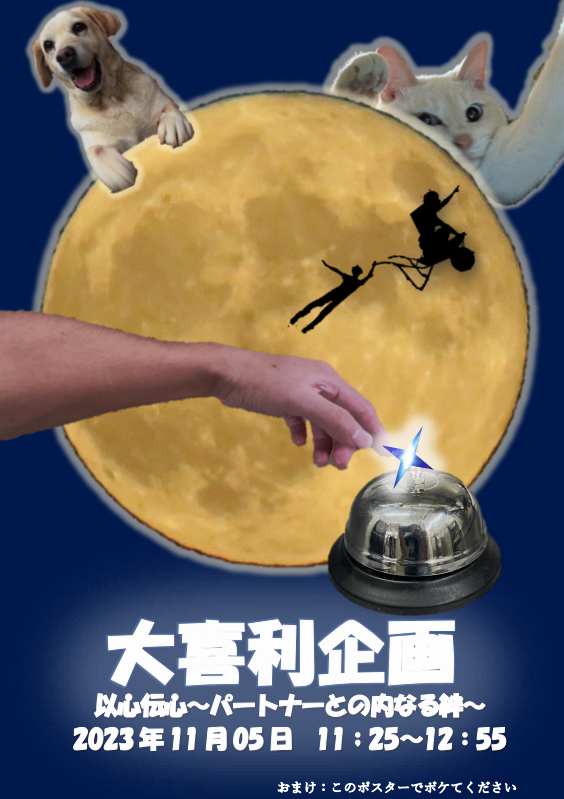
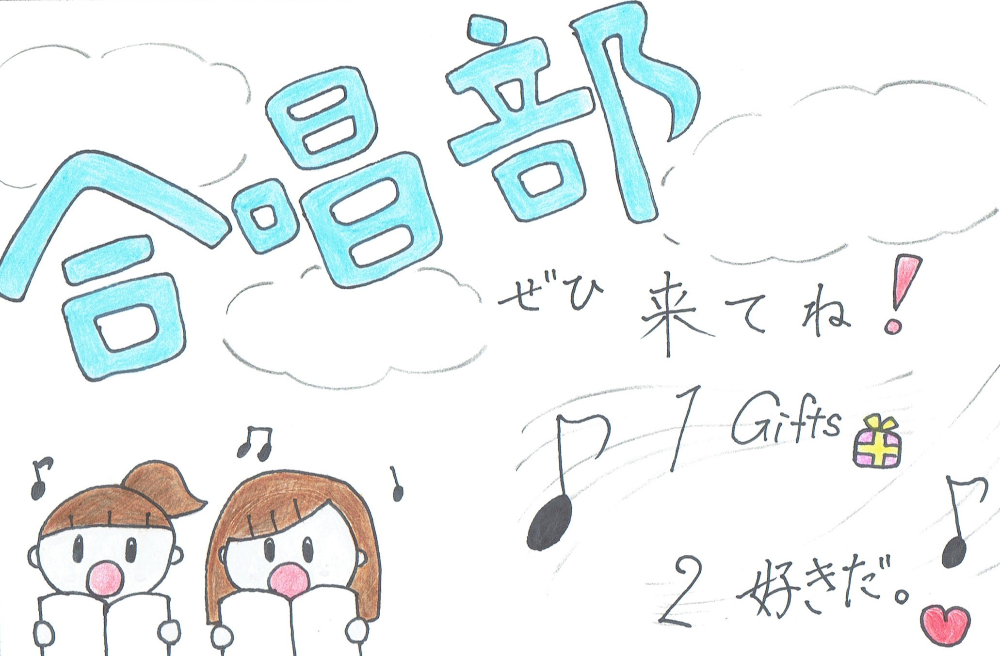
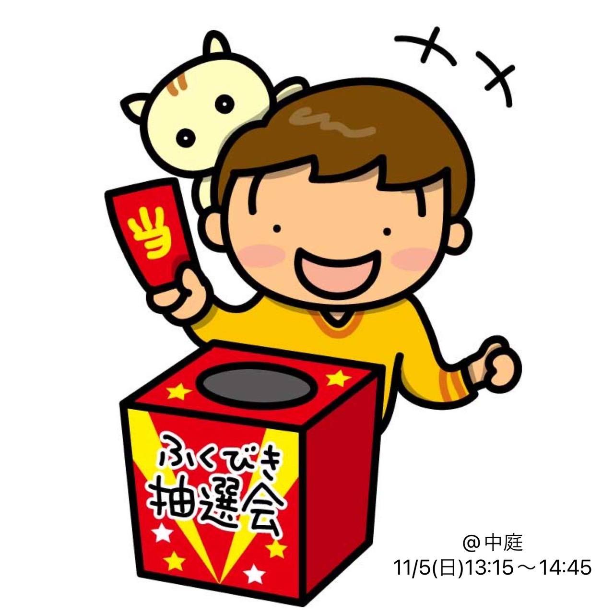
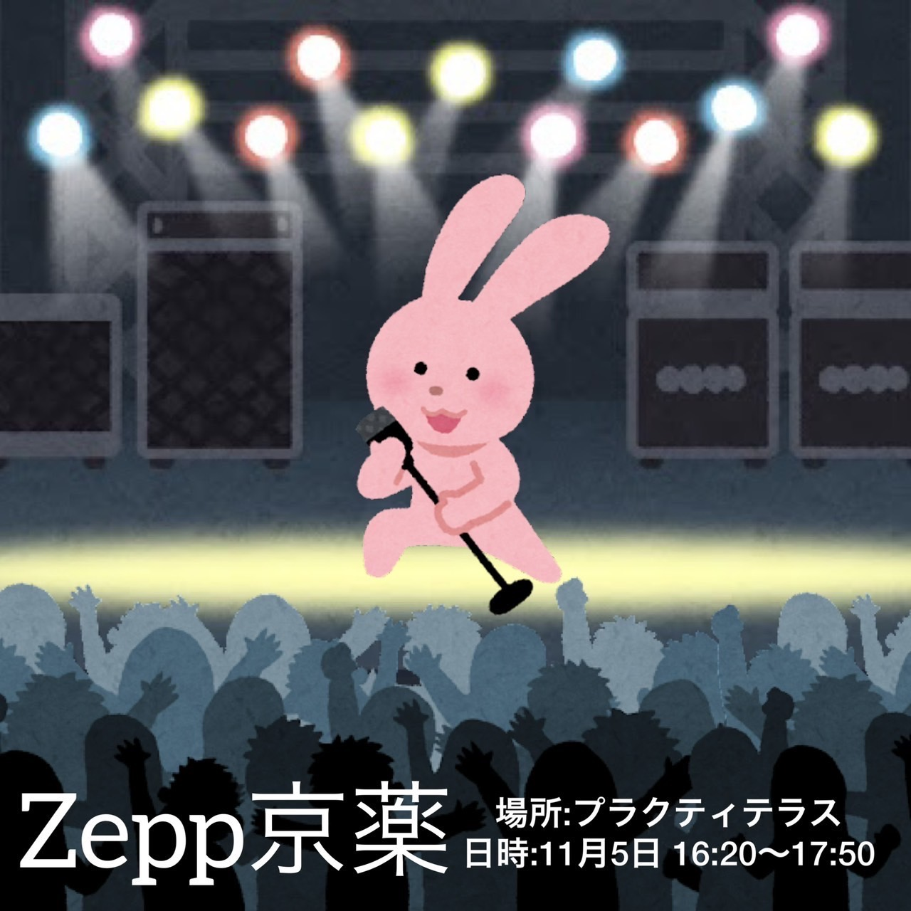

<!-- Main -->

<!-- One -->
<section id="one">
	

		<header class="major">
			<h1>11月4日 （土）</h1>
		</header>
		<!-- 
Nullam et orci eu lorem consequat tincidunt vivamus et sagittis magna sed nunc rhoncus condimentum sem. In efficitur ligula tate urna. Maecenas massa vel lacinia pellentesque lorem ipsum dolor. Nullam et orci eu lorem consequat tincidunt. Vivamus et sagittis libero. Nullam et orci eu lorem consequat tincidunt vivamus et sagittis magna sed nunc rhoncus condimentum sem. In efficitur ligula tate urna.
 -->
	

</section>

<!-- Two -->
<!-- 幕間 -->
<section id="two" class="spotlights">
	<section>
		
		

			

				<header class="major">
					<h2>幕間企画</h2>
				</header>
				
今年から復活した模擬店よりNo.1を決める「試食会」
				 真のファッショニスタを選ぶ「ファッションショー」。
				 はたしてみなさんの推しは何位に輝くのか！？。

				<!-- <ul class="actions">
					 <li><a href="generic.html" class="button">Learn more</a></li> 
				</ul> -->
			

		

	</section>
	<!-- クイズ -->
	<section>
		
		

			

				<header class="major">
					<h2>クイズ企画</h2>
				</header>
				
今年も個人戦と団体戦を行います！ 
				ぜひ気軽に参加してください！ 
				金田一少年と共に、多くの謎に挑戦してみませんか？

				<!-- <ul class="actions">
					<li><a href="generic.html" class="button">Learn more</a></li>
				</ul> -->
			

		

	</section>
	<!-- 有志 -->
	<!-- <section>
		
		

			

				<header class="major">
					<h3>ゲーム企画</h3>
				</header>
				
今年もゲーム大会を開催します！ 種目は「マリオカート」と「大乱闘スマッシュブラザーズ」です。 熱戦が期待されますのでぜひご覧ください！ また、飛び込み参加可の企画も用意しています。お気軽にご参加ください！

				<ul class="actions">
					<li><a href="generic.html" class="button">Learn more</a></li>
				</ul>
			

		

	</section> -->
	<section>
		
		

			

				<header class="major">
					<h2>有志企画</h2>
				</header>
				
19歳京都最年少大道芸人であり、2020年関西パフォーマンス大会第2位の受賞歴を持つ"performer yupon"！絶えない喋りと音楽に合わせたパフォーマンスで楽しさ、笑い、感動を皆様にお届け致します！

				<!-- <ul class="actions">
					<li><a href="generic.html" class="button">Learn more</a></li>
				</ul> -->
			

		

	</section>
	<!-- 京躍華 -->
	<section>
	
		

			

				<header class="major">
					<h2>京躍華</h2>
				</header>
				<!-- 暫定 要確認 -->
				
こんにちは！
						京都薬科大学で活動しております、京炎 そでふれ！京躍華です。 
						今年度は一般の方々も来場できる京薬祭が開催されるとのことで、大変嬉しく思っております。  今回私たちは、2020年度オリジナル演舞「結芽色（ゆめいろ）」、2023年度オリジナル演舞「世彩明（せいめい）」、京炎 そでふれ！スペシャルバージョンの3演舞を披露させていただきます。 例年、京躍華は引退された先輩方と共に演舞しており、今年は13期〜18期で演舞いたします！ 
					この日限りのメンバーが集結した京躍華を、是非お楽しみください！
				

				<!-- <ul class="actions">
					<li><a href="generic.html" class="button">Learn more</a></li>
				</ul> -->
			

		

	</section>
	<!-- Lod-->
	<section>
	
		

			

				<header class="major">
					<h2>LOD</h2>
				</header>
				
こんにちは! 京都薬科大学ダンスサークルLODです！ 
						今回は6ジャンルをはじめとする12チームで参加させていただきます。 
						LOD全員でこの日のために一生懸命練習してきました。  
						カッコいいダンスから女性らしいしなやかなダンスまで様々なジャンルで踊ります！ 
						是非ご覧ください！
				

				<!-- <ul class="actions">
					<li><a href="generic.html" class="button">Learn more</a></li>
				</ul> -->
			

		

	</section>
</section>
<!-- <one2> -->
<!-- One -->
<section id="one">
	

		<header class="major">
			<h1>11月5日 （日）</h1>
		</header>
		<!-- 
Nullam et orci eu lorem consequat tincidunt vivamus et sagittis magna sed nunc rhoncus condimentum sem. In efficitur ligula tate urna. Maecenas massa vel lacinia pellentesque lorem ipsum dolor. Nullam et orci eu lorem consequat tincidunt. Vivamus et sagittis libero. Nullam et orci eu lorem consequat tincidunt vivamus et sagittis magna sed nunc rhoncus condimentum sem. In efficitur ligula tate urna.
 -->
	

</section>

<section id="two" class="spotlights">
	<!-- 管弦楽部 -->
	<section>
		
		

			

				<header class="major">
					<h2>管弦楽部</h2>
				</header>
				
こんにちは！管弦楽部です！ 
					今回はハリーポッターなどの必ず一度は聞いたことのある有名な曲が勢ぞろい‼︎計4曲演奏いたします。 
					そして！11/25(土)に長岡京記念会館にて第51回定期演奏会を行います。どなたでもお気軽にお越しください！

				<!-- <ul class="actions">
					<li><a href="generic.html" class="button">Learn more</a></li>
				</ul> -->
			

		

	</section>
	<!-- 大喜利 -->
	<section>
		
		

			

				<header class="major">
					<h2>大喜利企画</h2>
				</header>
				
今年の大喜利企画は様々なゲームを通してパートナーとの内なる絆を発見して頂きます。参加者の方も観覧者の方も楽しめる内容に企画員一同頑張っていきますのでぜひぜひ一緒に盛り上げていきましょう！？

				<!-- <ul class="actions">
					<li><a href="generic.html" class="button">Learn more</a></li>
				</ul> -->
			

		

	</section>
	<!-- 合唱部 -->
	<section>
		
		

			

				<header class="major">
					<h2>合唱部</h2>
				</header>
				
私たちは部員12人で明るく楽しく活動しています。 今回披露する曲は第85回NHK合唱音楽コンクールの課題曲である「Gifts」とLittle Glee Monsterの「好きだ。」です。 ぜひ聴きに来てください。

				<!-- <ul class="actions">
					<li><a href="generic.html" class="button">Learn more</a></li>
				</ul> -->
			

		

	</section>
	<!-- ふくびき -->
	<section>
		
		

			

				<header class="major">
					<h2>ふくびき企画</h2>
				</header>
				
中庭にてふくびき&ビンゴ大会を開催！ ふくびき券・ビンゴ用紙は、当日の開門から12:45まで配布します！ 誰でも参加可能です！ ※抽選会の際に学内にいらっしゃらない場合、無効となりますのでご注意ください。

				<!-- <ul class="actions">
					<li><a href="generic.html" class="button">Learn more</a></li>
				</ul> -->
			

		

	</section>
	<!-- カラオケ -->
	<section>
		
		

			

				<header class="major">
					<h2>カラオケ企画</h2>
				</header>
				
今年のカラオケ企画は一味違う！？ トーナメント式の個人戦に加え、 はじめての試みとなる団体戦も… 京薬生による、魂のパフォーマンスを見逃すな！ Zepp京薬、アツい対バンLIVEで盛り上がれ！

				<!-- <ul class="actions">
					<li><a href="generic.html" class="button">Learn more</a></li>
				</ul> -->
			

		

	</section>
</section>

<!-- Three -->
<!-- <section id="three">
	

		<header class="major">
			<h2>Massa libero</h2>
		</header>
		
Nullam et orci eu lorem consequat tincidunt vivamus et sagittis libero. Mauris aliquet magna magna sed nunc rhoncus pharetra. Pellentesque condimentum sem. In efficitur ligula tate urna. Maecenas laoreet massa vel lacinia pellentesque lorem ipsum dolor. Nullam et orci eu lorem consequat tincidunt. Vivamus et sagittis libero. Mauris aliquet magna magna sed nunc rhoncus amet pharetra et feugiat tempus.

		<ul class="actions">
			<li><a href="generic.html" class="button next">Get Started</a></li>
		</ul>
	

</section> -->

