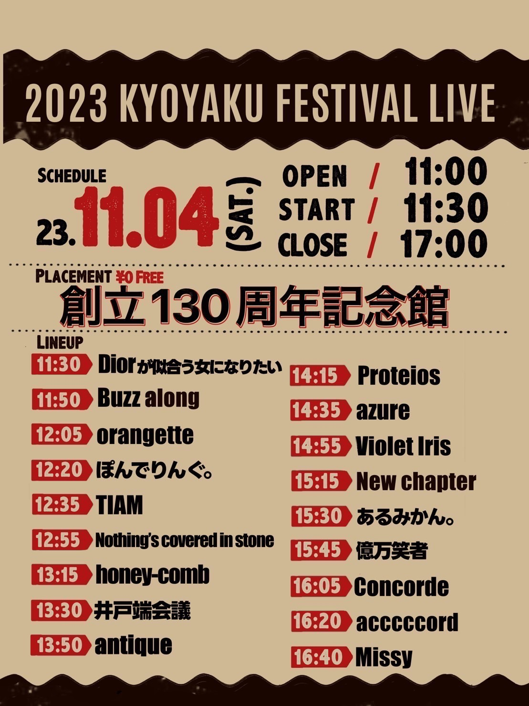
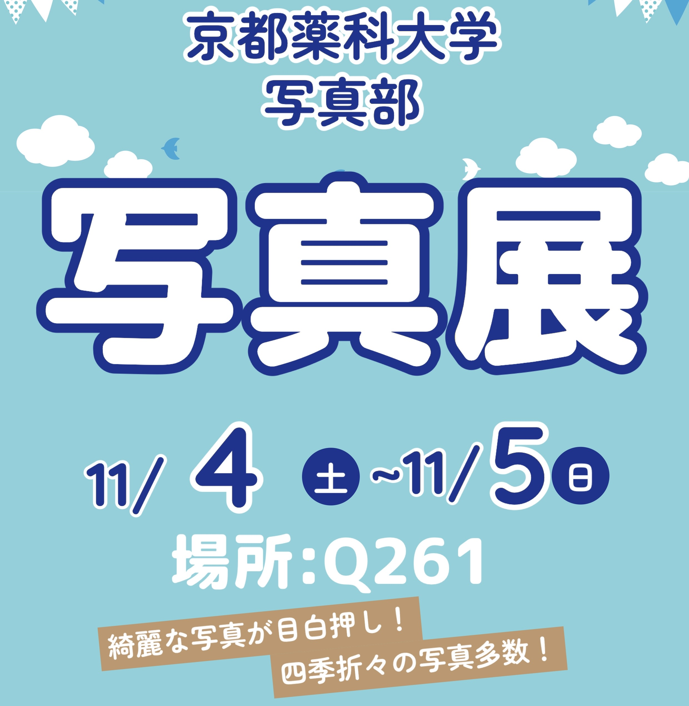
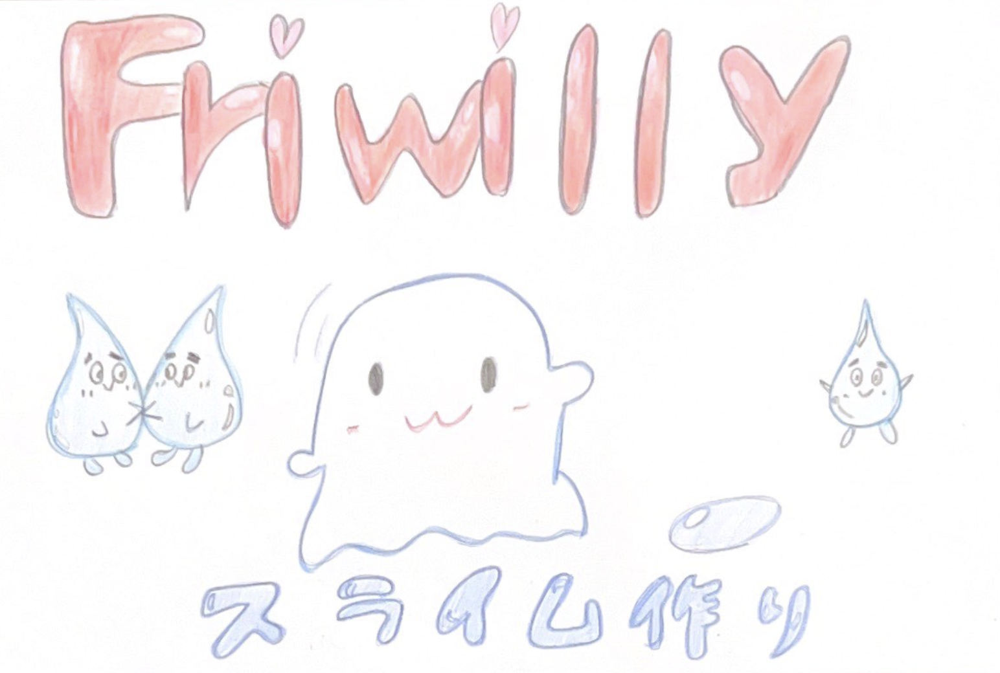
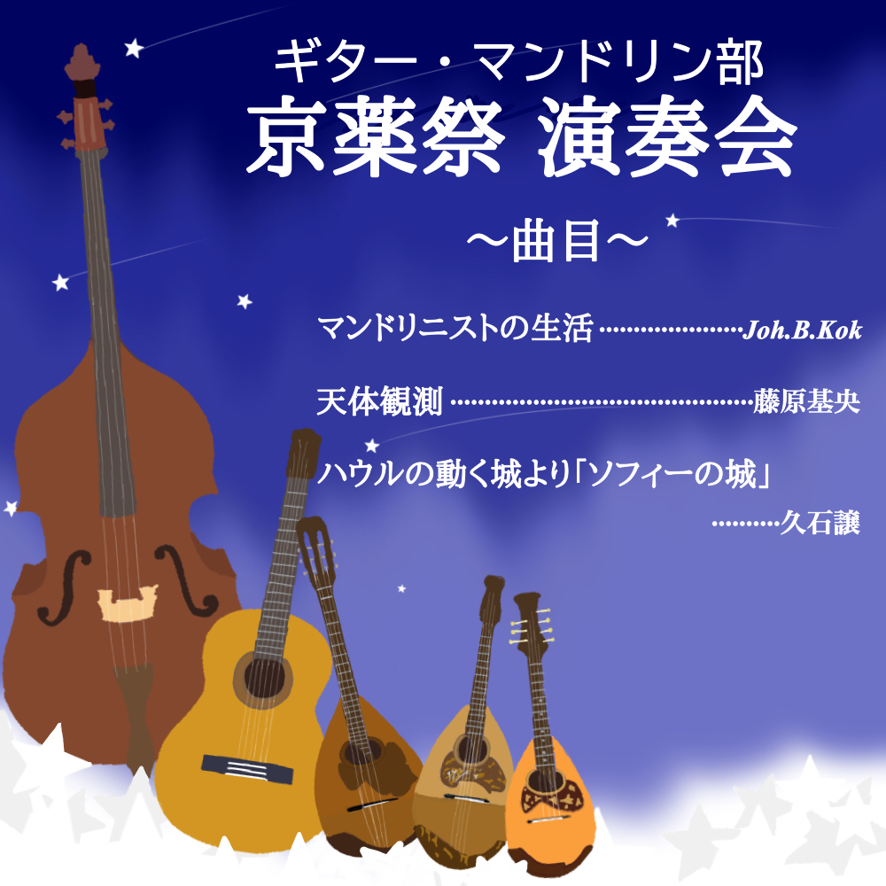
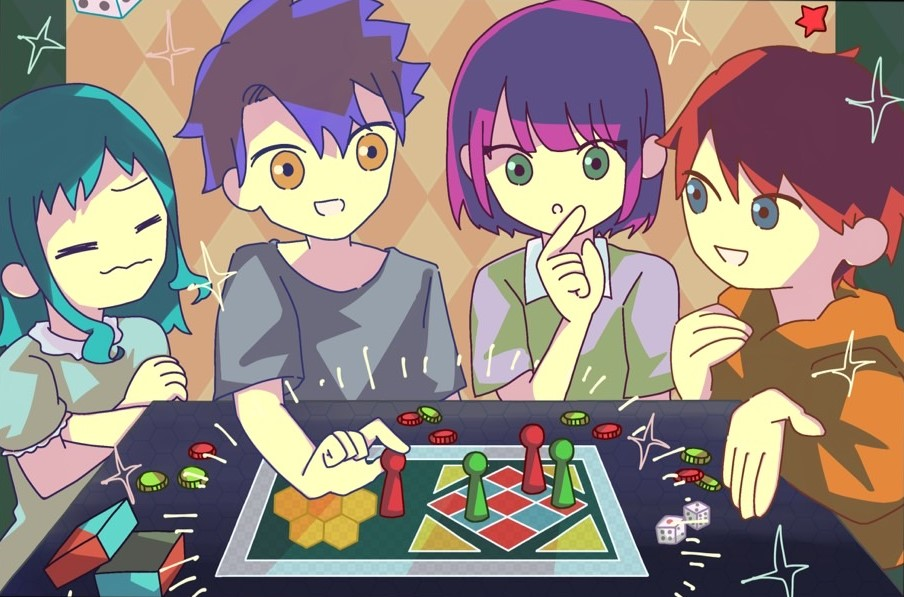
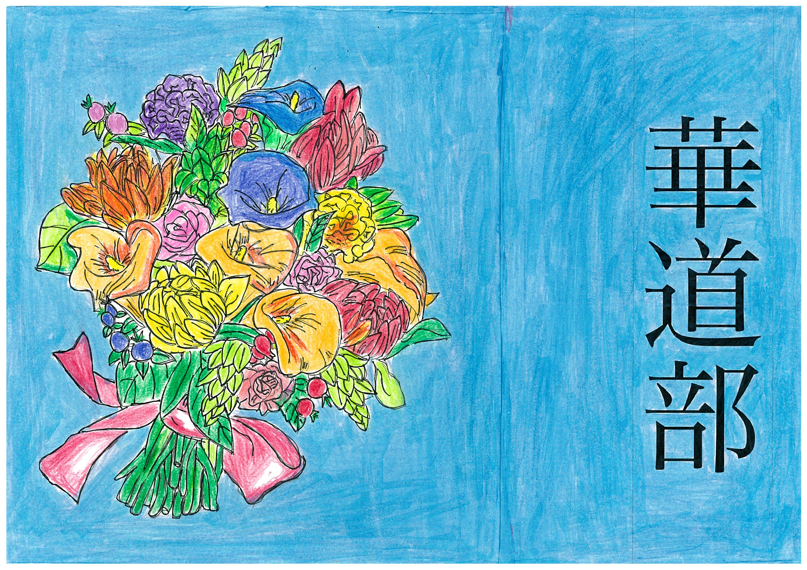

<!-- Main -->

<!-- One -->
<section id="one">
	

		<header class="major">
			<h1>記念館</h1>
		</header>
		<!-- 
Nullam et orci eu lorem consequat tincidunt vivamus et sagittis magna sed nunc rhoncus condimentum sem. In efficitur ligula tate urna. Maecenas massa vel lacinia pellentesque lorem ipsum dolor. Nullam et orci eu lorem consequat tincidunt. Vivamus et sagittis libero. Nullam et orci eu lorem consequat tincidunt vivamus et sagittis magna sed nunc rhoncus condimentum sem. In efficitur ligula tate urna.
 -->
	

</section>

<!-- Two -->
<!-- 軽音 -->
<section id="two" class="spotlights">
	<section>
		<a href="generic.html" class="image">
			<!--  -->
			
		</a>
		

			

				<header class="major">
					<h2>軽音部</h2>
				</header>
				京都薬科大学軽音部の固定バンド16組、そして卒部されたOBの方々によるバンド2組、計18組が総出演‼︎最近の曲、盛り上がる曲、いっぱい持ってきました！ステージにいるバンドマンだけでなく、足を運んでくださった皆さんも一丸となって盛り上げていきます！  
        ぜひ観に来てください‼︎
			

		

	</section>
</section>
	<!-- One -->
<section id="one">
	

		<header class="major">
			<h1>躬行館</h1>
		</header>
		<!-- 
Nullam et orci eu lorem consequat tincidunt vivamus et sagittis magna sed nunc rhoncus condimentum sem. In efficitur ligula tate urna. Maecenas massa vel lacinia pellentesque lorem ipsum dolor. Nullam et orci eu lorem consequat tincidunt. Vivamus et sagittis libero. Nullam et orci eu lorem consequat tincidunt vivamus et sagittis magna sed nunc rhoncus condimentum sem. In efficitur ligula tate urna.
 -->
	

</section>
<section id="two" class="spotlights">
	<!-- ゲーム企画 -->
	<section>
		
		

			

				<header class="major">
					<h2>ゲーム企画</h2>
				</header>
				
今年もゲーム大会を開催します！ 種目は「マリオカート」と「大乱闘スマッシュブラザーズ」です。 熱戦が期待されますのでぜひご覧ください！ また、飛び込み参加可の企画も用意しています。お気軽にご参加ください！

				<!-- <ul class="actions">
					<li><a href="generic.html" class="button">Learn more</a></li>
				</ul> -->
			

		

	</section>
<!-- 写真 -->
  <section>
		
		

			

				<header class="major">
					<h2>写真部</h2>
				</header>
				
部員の四季折々の写真を展示しています！ 構図や色彩にこだわった良い作品が多く、満足すること間違いなし！ 見ないと損、インスタ映えの勉強にもなるのでぜひお越しください

				<!-- <ul class="actions">
					<li><a href="generic.html" class="button">Learn more</a></li>
				</ul> -->
			

		

	</section>
<!-- Fri -->
  <section>
		
		

			

				<header class="major">
					<h2>Friwilly</h2>
				</header>
				
【無料】中学生以下限定！ 持ち帰りOK！ オリジナルスライムを作って遊ぼう！！

				<!-- <ul class="actions">
					<li><a href="generic.html" class="button">Learn more</a></li>
				</ul> -->
			

		

	</section>
<!-- 美術部 -->
	<section>
			
			

				

					<header class="major">
						<h2>美術部</h2>
					</header>
					
こんにちは、美術部です！ 普段は和気藹々と作品制作をしています。 京薬祭では作品の展示を行うほか、ポストカードの販売を再開予定です。 画材も題材も異なる、各々の表現がつまった空間をぜひご覧ください。

					<!-- <ul class="actions">
						<li><a href="generic.html" class="button">Learn more</a></li>
					</ul> -->
				

			

		</section>
<!-- ギター・マンドリン -->
	<section>
			
			

				

					<header class="major">
						<h2>ギター・マンドリン部</h2>
					</header>
					
ギター・マンドリン部です！3回生1人2回生14人1回生7人で活動しています！「マンドリニストの生活」と「天体観測」と「ハウルの動く城より「ソフィーの城」」を演奏します！ぜひ聞きに来てください！

					<!-- <ul class="actions">
						<li><a href="generic.html" class="button">Learn more</a></li>
					</ul> -->
				

			

		</section>
<!-- らくしあ -->
	<section>
			
			

				

					<header class="major">
						<h2>らくしあ</h2>
					</header>
					
らくしあでは、ボードゲームやTRPGをはじめとしたアナログゲームを主な活動として行っております。 今回の展示では、ボードゲームの体験会を開催いたします。 ボードゲームの奥深さ。これを少しでも感じていただけると嬉しいです！

					<!-- <ul class="actions">
						<li><a href="generic.html" class="button">Learn more</a></li>
					</ul> -->
				

			

		</section>
<!-- 華道部 -->
		<section>
			
			

				

					<header class="major">
						<h2>華道部</h2>
					</header>
					
私たち華道部は、たくさんのお花に触れながら楽しく活動しております。 京薬祭では部員が実際に生けたお花を展示させていただきます。ぜひ見に来てください。

					<!-- <ul class="actions">
						<li><a href="generic.html" class="button">Learn more</a></li>
					</ul> -->
				

			

		</section>
	
</section>

<!-- Three -->
<!-- <section id="three">
	

		<header class="major">
			<h2>Massa libero</h2>
		</header>
		
Nullam et orci eu lorem consequat tincidunt vivamus et sagittis libero. Mauris aliquet magna magna sed nunc rhoncus pharetra. Pellentesque condimentum sem. In efficitur ligula tate urna. Maecenas laoreet massa vel lacinia pellentesque lorem ipsum dolor. Nullam et orci eu lorem consequat tincidunt. Vivamus et sagittis libero. Mauris aliquet magna magna sed nunc rhoncus amet pharetra et feugiat tempus.

		<ul class="actions">
			<li><a href="generic.html" class="button next">Get Started</a></li>
		</ul>
	

</section> -->

