<!-- Main -->

<!-- One -->
<!-- <section id="one">
	

		<header class="major">
			<h1>記念館</h1>
		</header>
		
Nullam et orci eu lorem consequat tincidunt vivamus et sagittis magna sed nunc rhoncus condimentum sem. In efficitur ligula tate urna. Maecenas massa vel lacinia pellentesque lorem ipsum dolor. Nullam et orci eu lorem consequat tincidunt. Vivamus et sagittis libero. Nullam et orci eu lorem consequat tincidunt vivamus et sagittis magna sed nunc rhoncus condimentum sem. In efficitur ligula tate urna.

	

</section> -->

<section id="two" class="spotlights">
  <section>
		
		

			

				<header class="major">
					<h2>男子バレーボール部「焼ききゅん♡そぉばぁ」</h2>
				</header>
        <h3>やきぞば　500円</h3>
				<!-- <ul class="actions">
					 <li><a href="generic.html" class="button">Learn more</a></li> 
				</ul> -->
			

		

	</section>
	<section>
		<a class="image">
			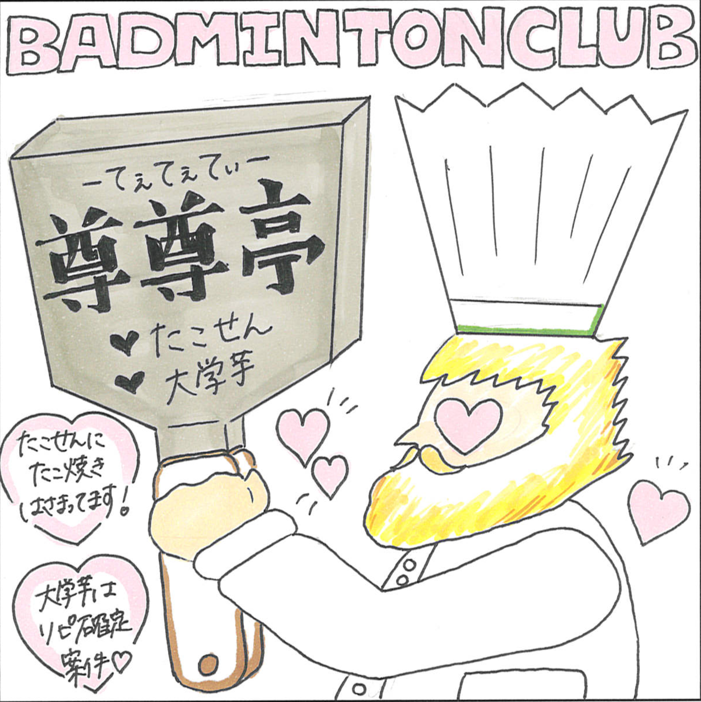
		</a>
		

			

				<header class="major">
					<h2>バドミントン部</h2>
				</header>
				<h3>たこせん 200円 
				大学芋 200円</h3>
				<!-- <ul class="actions">
					 <li><a href="generic.html" class="button">Learn more</a></li> 
				</ul> -->
			

		

	</section>
	 <section>
		
		

			

				<header class="major">
					<h2>Friwilly「バタフライピー＆かき氷屋さん」</h2>
				</header>
        <h3>かき氷　250円 
        バタフライピー　200円</h3>
				<!-- <ul class="actions">
					 <li><a href="generic.html" class="button">Learn more</a></li> 
				</ul> -->
			

		

	</section>
  <section>
		<a class="image">
			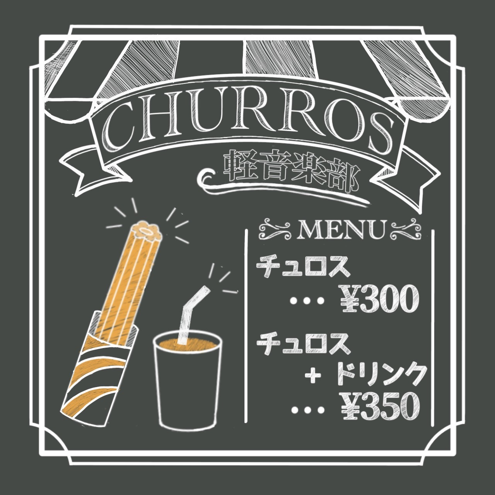
		</a>
		

			

				<header class="major">
					<h2>軽音楽部「ちゅろす・ざ・ろっく」</h2>
				</header>
				<h3>チュロス 300円
         チュロス＋ドリンク　350円</h3>
				<!-- <ul class="actions">
					 <li><a href="generic.html" class="button">Learn more</a></li> 
				</ul> -->
			

		

	</section>
  <section>
		<a class="image">
			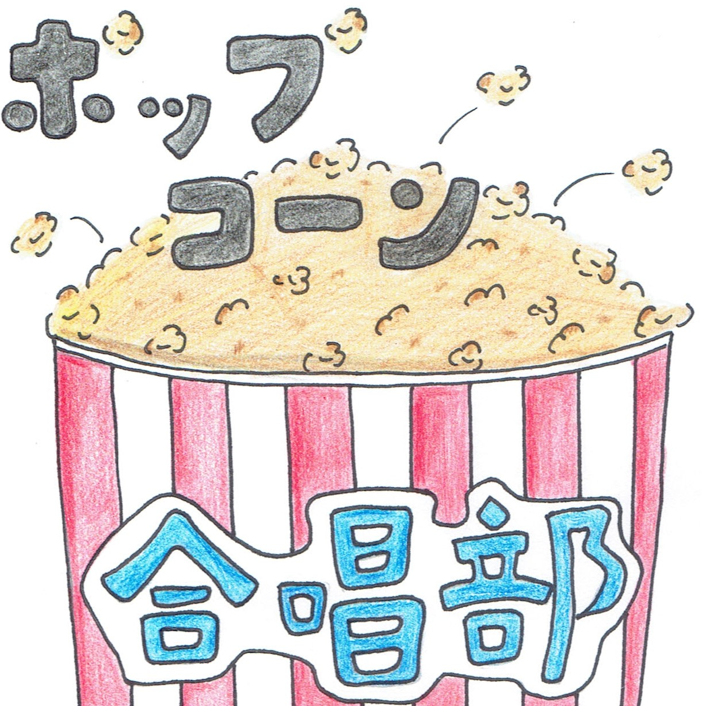
		</a>
		

			

				<header class="major">
					<h2>合唱部「ポップコーン」</h2>
				</header>
				<h3>ポップコーン　150円</h3>
				<!-- <ul class="actions">
					 <li><a href="generic.html" class="button">Learn more</a></li> 
				</ul> -->
			

		

	</section>
	<section>
		
		

			

				<header class="major">
					<h2>ESS「ESSのBOILED GYOZA」</h2>
				</header>
				<h3>水餃子　300円</h3>
				<!-- <ul class="actions">
					 <li><a href="generic.html" class="button">Learn more</a></li> 
				</ul> -->
			

		

	</section>
	<section>
		
		

			

				<header class="major">
					<h2>剣道部「ジョニーを倒せ！」</h2>
				</header>
				<h3>1回 100円</h3>
				<!-- <ul class="actions">
					 <li><a href="generic.html" class="button">Learn more</a></li> 
				</ul> -->
			

		

	</section>
	<section>
		<a class="image">
			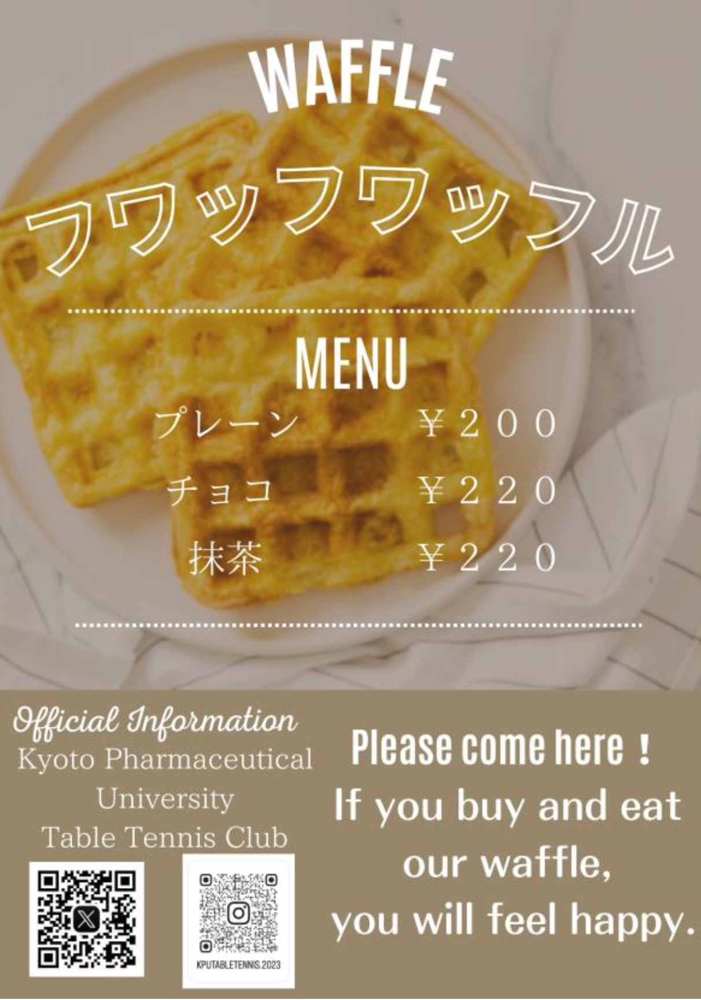
		</a>
		

			

				<header class="major">
					<h2>卓球部「フワッフワッフル」</h2>
				</header>
				<h3>
				  <ul>
						<ul>
							<li>ワッフル 
									<ul>
									<li>プレーン 200 円</li>
									<li>チョコ，抹茶 220 円</li>
									</ul>
							</li>
							</ul>
						</ul>
　　　　　</h3>
				<!-- <ul class="actions">
					 <li><a href="generic.html" class="button">Learn more</a></li> 
				</ul> -->
			

		

	</section>
	<section>
		<a class="image">
			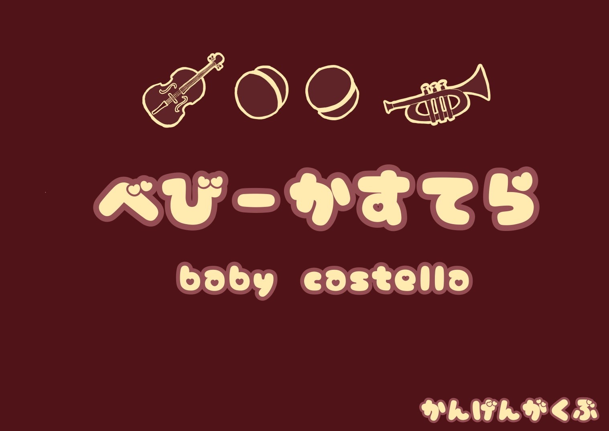
		</a>
		

			

				<header class="major">
					<h2>管弦楽部「Okastera」</h2>
				</header>
				<h3>ベビーカステラ　300円/400円/500円
　　　　　</h3>
				<!-- <ul class="actions">
					 <li><a href="generic.html" class="button">Learn more</a></li> 
				</ul> -->
			

		

	</section>
	<section>
		<a class="image">
			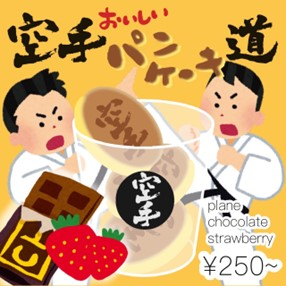
		</a>
		

			

				<header class="major">
					<h2>空手道部「空手パンケーキ道」</h2>
				</header>
				<h3>パンケーキ　400円  （トッピング(いちご，チョコソース)＋50円）
　　　　　</h3>
				<!-- <ul class="actions">
					 <li><a href="generic.html" class="button">Learn more</a></li> 
				</ul> -->
			

		

	</section>
	<section>
		<a class="image">
			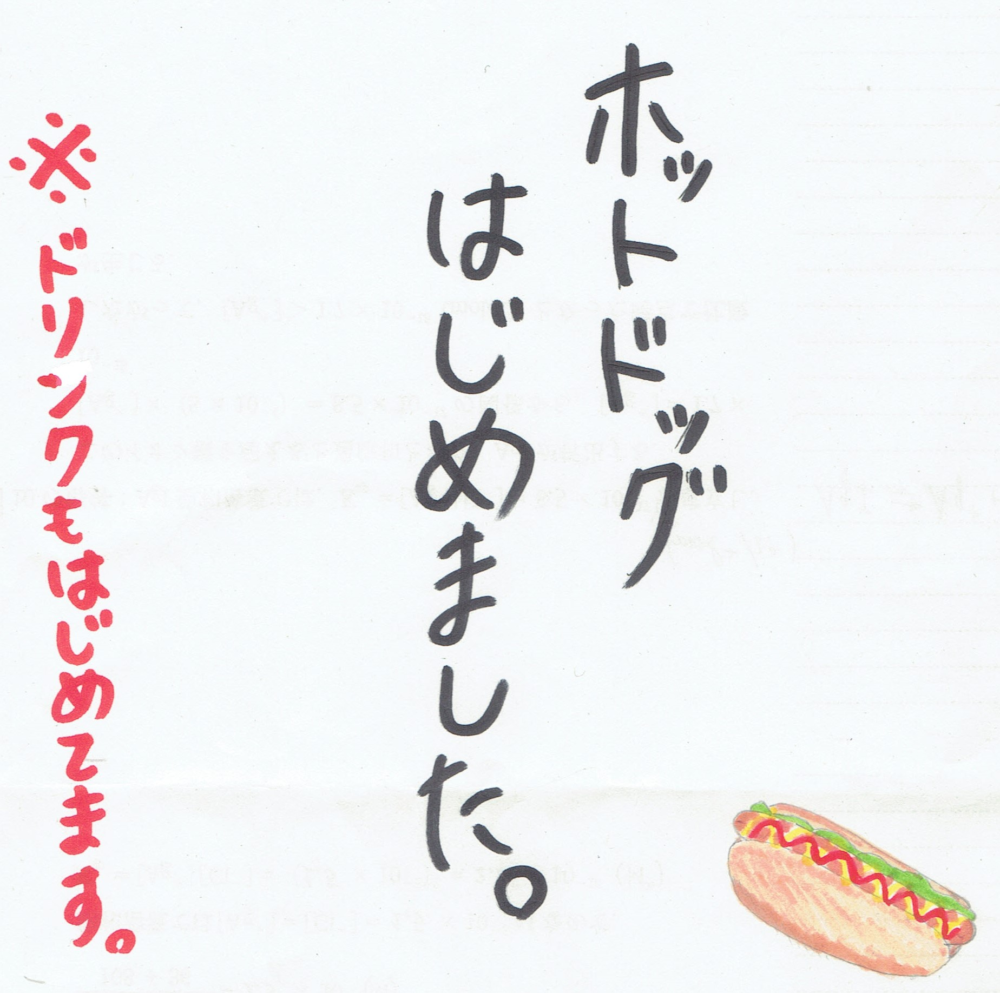
		</a>
		

			

				<header class="major">
					<h2>女子バレーボール部「ホットドッグはじめました。」</h2>
				</header>
				<h3>
				  <ul>
						<ul>
							<li>ホットドッグ 250 円
								</li>
							<li>ドリンク 100円
									<ul>
									<li>オレンジジュース</li>
									<li>コーラ</li>
									<li>ジンジャーエール</li>
									<li>ウーロン茶</li>
									</ul>
							</li>
							<li>セット 300 円</li>
							</ul>
						</ul>
　　　　　</h3>
				<!-- <ul class="actions">
					 <li><a href="generic.html" class="button">Learn more</a></li> 
				</ul> -->
			

		

	</section>
	<section>
		<a class="image">
			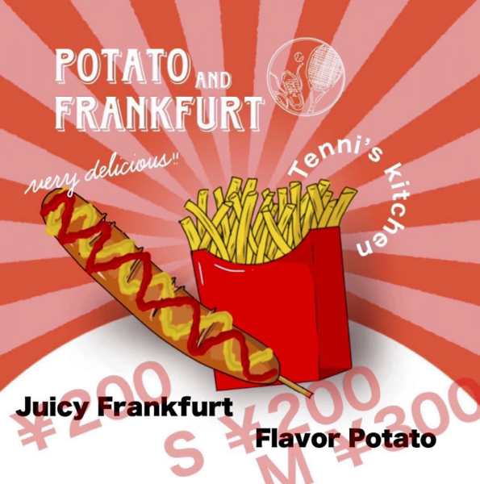
		</a>
		

			

				<header class="major">
					<h2>硬式テニス部「Tenni’s kitchen」</h2>
				</header>
				<h3>
				  <ul>
						<ul>
							<li>フランクフルト 200円
							</li>
							<li>フレーバーポテト</li>
							<ul>
									<li>S 200円</li>
									<li>M 300円</li>
									</ul>
							</ul>
						</ul>
　　　　　</h3>
				<!-- <ul class="actions">
					 <li><a href="generic.html" class="button">Learn more</a></li> 
				</ul> -->
			

		

	</section>
	<section>
		<a class="image">
			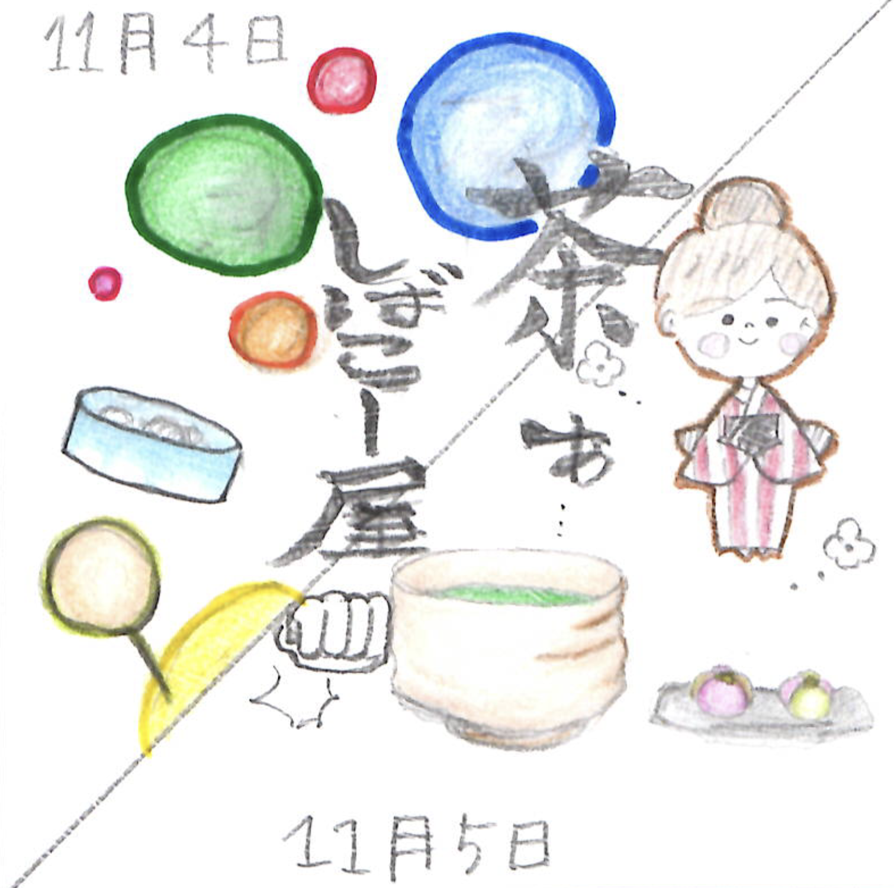
		</a>
		

			

				<header class="major">
					<h2>茶道部「茶ぁ…しばこー屋」</h2>
				</header>
				<h3>4日：スーパーボールすくい　200円  
				5日：抹茶と和菓子のセット　500円
　　　　　</h3>
				<!-- <ul class="actions">
					 <li><a href="generic.html" class="button">Learn more</a></li> 
				</ul> -->
			

		

	</section>
	<section>
		<a class="image">
			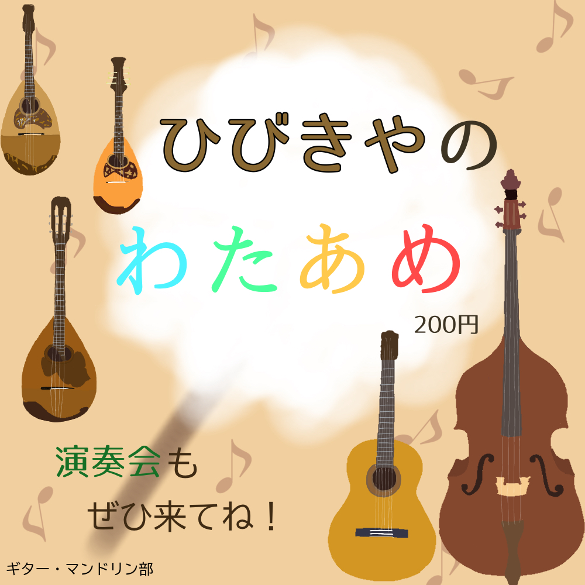
		</a>
		

			

				<header class="major">
					<h2>ギター・マンドリン部「ひびきや」</h2>
				</header>
				<h3>わたあめ　200円</h3>
				<!-- <ul class="actions">
					 <li><a href="generic.html" class="button">Learn more</a></li> 
				</ul> -->
			

		

	</section>
	<section>
		<a class="image">
			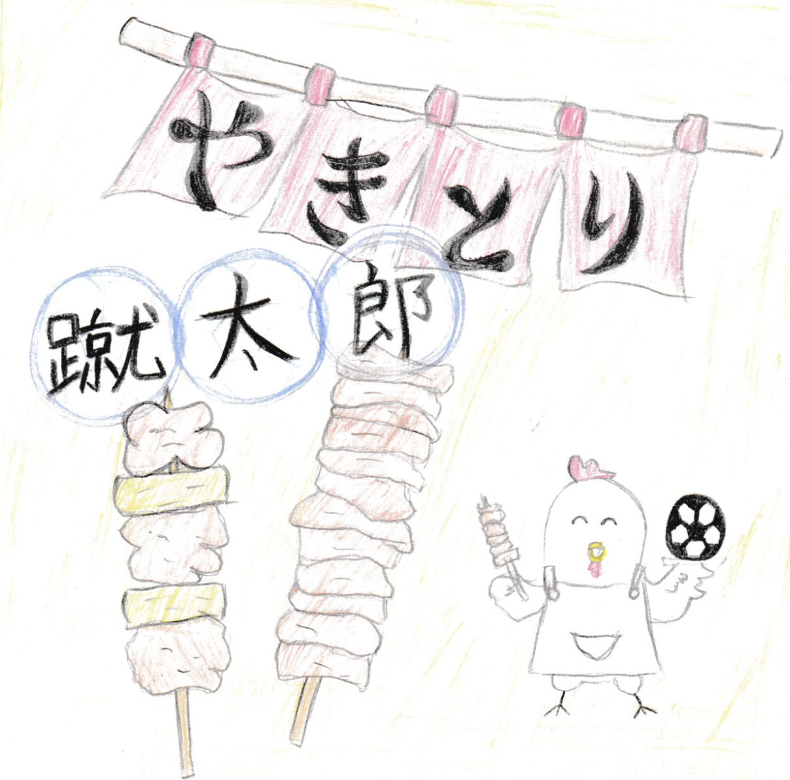
		</a>
		

			

				<header class="major">
					<h2>サッカー部「やきとり蹴太郎」</h2>
				</header>
				<h3>
				  <ul>
						<ul>
							<li>やきとり 150円
									<ul>
									<li>もも</li>
									<li>むね</li>
									<li>ぼんじり</li>
									<li>皮</li>
									</ul>
							</li>
							<li>コーラ 100円</li>
							<li>ラムネ 200円</li>
							<li>カルピス 150円</li>
							</ul>
						</ul>
　　　　　</h3>
				<!-- <ul class="actions">
					 <li><a href="generic.html" class="button">Learn more</a></li> 
				</ul> -->
			

		

	</section>
	<section>
		<a class="image">
			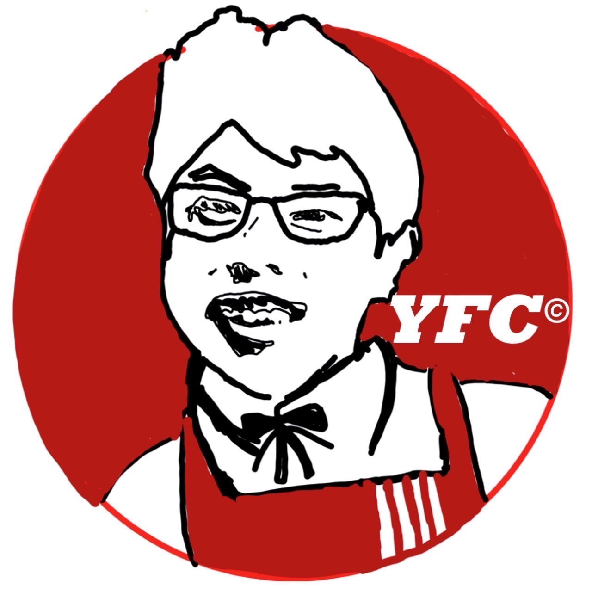
		</a>
		

			

				<header class="major">
					<h2>ヨット部「YFC」</h2>
				</header>
				<h3>唐揚げ 400円 クリームスープ 300円
　　　　　</h3>
				<!-- <ul class="actions">
					 <li><a href="generic.html" class="button">Learn more</a></li> 
				</ul> -->
			

		

	</section>
	<section>
		<a class="image">
			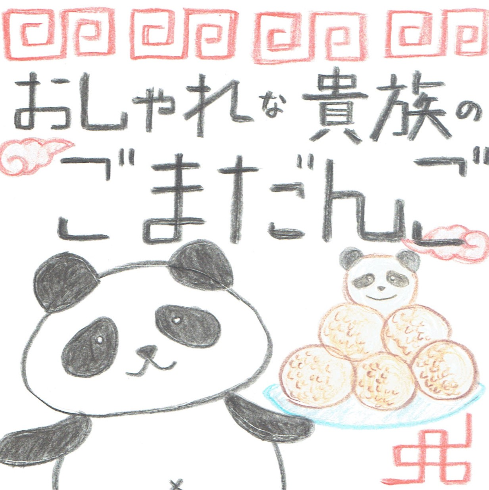
		</a>
		

			

				<header class="major">
					<h2>おしゃれ貴族「おしゃれな貴族のごまだんご」</h2>
				</header>
				<h3>ごまだんご 300円 ホットドリンク 150円   ごまだんご＋ドリンク 400円
　　　　　</h3>
				<!-- <ul class="actions">
					 <li><a href="generic.html" class="button">Learn more</a></li> 
				</ul> -->
			

		

	</section>

</section>

